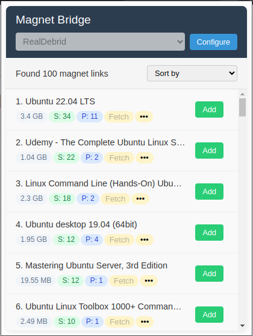
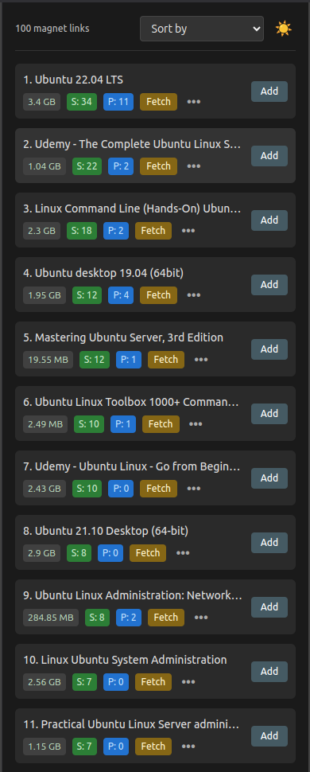

# 🚀 Magnet Bridge - Chrome Extension

**Magnet Bridge** is a powerful and easy-to-use Chrome Extension that automatically detects and extracts **torrent magnet links** and **.torrent files** from any webpage. Easily manage your downloads or send them to your favorite **cloud torrent services** like **RealDebrid, AllDebrid, Torbox, Seedr, Bitport, and Put.io** — all within your browser.

---

## 🌟 Features

✅ **Auto Extract Magnet Links**  
Instantly scans webpages and lists all available magnet links.

✅ **One-Click Copy**  
Copy magnet links effortlessly with a single click.

✅ **Download .torrent Files**  
Detect and download `.torrent` files if available on the page.

✅ **Cloud Torrent Integration**  
Send magnet links or torrent files directly to services like:
- **RealDebrid**
- **AllDebrid**
- **Torbox**
- **Seedr**
- **Bitport**
- **Put.io**

✅ **Popup UI + Side Panel**  
Use the clean popup interface, or enable the **side panel** to browse magnet links without opening the popup.

✅ **Auto Refresh on Tab Switch or DOM Change**  
The extension keeps your magnet list updated when you switch tabs or the webpage content changes.

---

## 🧭 Side Panel Support

With **Side Panel** support, you can:
- Open a persistent view of Magnet Bridge directly in Chrome's side panel.
- See all magnet links from the current tab without clicking the extension icon.
- Auto-update the list when you switch tabs or when the webpage changes dynamically.

This improves your workflow by keeping everything visible while you browse.

🧪 *To use the side panel:*
1. Right click the extension icon → `Open side panel`
2. Pin it for always-on access
3. Let it run in the background while you surf torrent websites

---

## 📥 Installation Guide

1. Download the latest `extension.zip` from the Releases section and unzip it.  
   Or clone the repository and build manually.
2. Go to `chrome://extensions/`
3. Enable **Developer mode** (top right).
4. Click **Load unpacked** and select the `dist` folder.
5. Done! Enjoy using Magnet Bridge 🎉

---

## 🔧 How to Use

1. Open any webpage containing magnet links or torrent downloads.
2. Click the **Magnet Bridge** icon or use the **Side Panel**.
3. Browse the extracted links.
4. Choose to:
   - **Copy** the magnet link
   - **Download** `.torrent` file
   - **Send** to your preferred cloud torrent service

---

## 🔑 API Key Setup (for Cloud Services)

To integrate with services like RealDebrid, AllDebrid, Torbox, Seedr, Bitport, and Put.io:

1. Open the **Configure** section inside the extension.
2. Paste your **API key** or **access token**.
3. Save and start adding torrents directly to your cloud!

---

## 📜 Required Permissions

- **Active Tab** – To scan and extract magnet links from the current webpage.
- **Storage** – To save your API keys securely using Chrome's sync storage.
- **Side Panel** – To offer a persistent, enhanced user experience.

🔒 *Your data is stored securely on your local device or synced across devices via Chrome Sync.*  
[Learn more about Chrome Sync Storage](https://developer.chrome.com/docs/extensions/reference/storage#property-sync)

---

### 🖼️ Extension Popup

### 📌 Side Panel View

Make sure these images are committed and pushed to your repository so they render on GitHub.

---

## 🤝 Contributing

We welcome your contributions!  
Feel free to fork the repo, create a feature branch, and submit a pull request.  
Bug fixes, enhancements, and new ideas are always appreciated! 😊

---

## 📩 Support

Need help or have a feature request?  
Open an issue in the [GitHub repository](https://github.com/SM227465/MagnetBridge) or contact the maintainer directly.